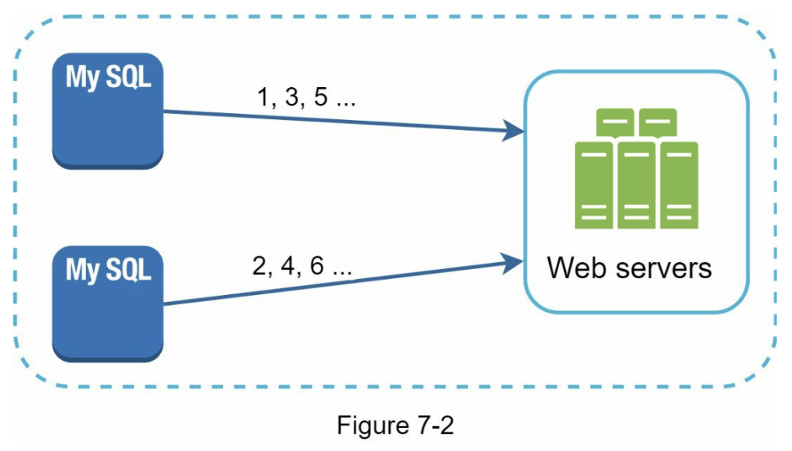
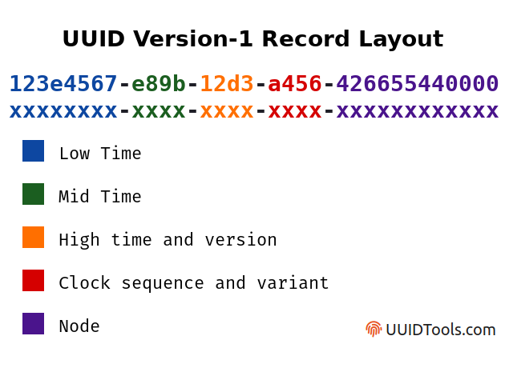
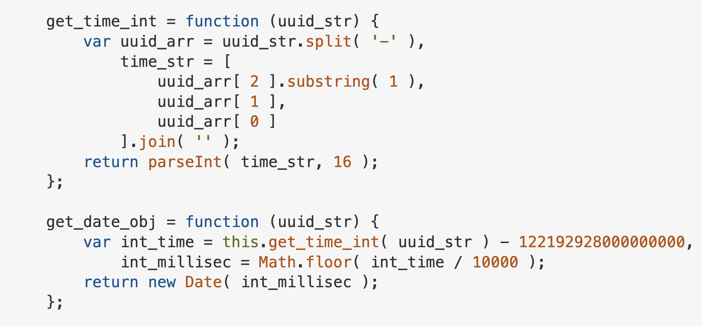
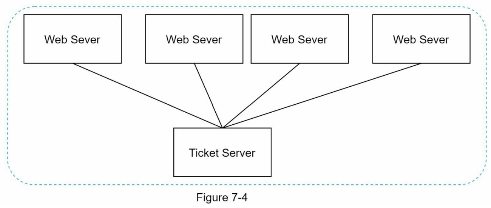
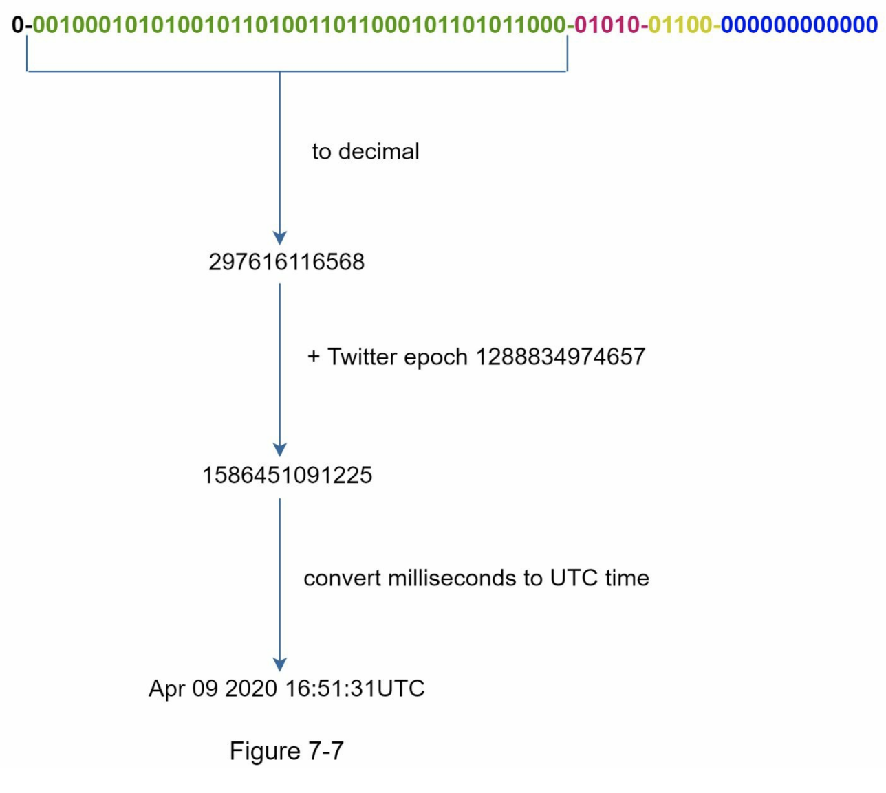
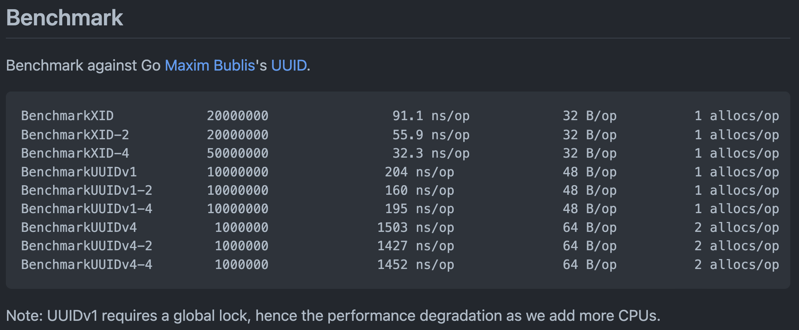

# 第七章：設計可用於分散式系統的唯一 ID 生成器

## 前言

唯一 ID 在系統中很重要，在單資料庫伺服器中，可以利用 primary key + _auto_increment_ 屬性來實作唯一 ID，但在分散式系統中，有多資料庫伺服器間的同步問題，本篇會介紹四種方法，以及各自的優缺點及使用時機

## 步驟一：需求範圍確認

Q: 唯一 ID 須具備哪些性質

A: 須為唯一且可依時間先後排序

Q: 新生成的 ID，是否為上一個 ID + 1

A: ID 需隨時間嚴格遞增，但不一定需要絕對差距 1

Q: ID 是否全為數字，還是可以有文字

A: 需全為數字

Q: ID 的長度有限制嗎

A: 需為 64-bit

Q: 系統的規模有多大

A: 每秒需要能產生 10,000 IDs

## 步驟二：high-level 架構

四種分散式系統中唯一 ID 的設計方法：

1. Multi-master replication
2. Universally unique identifier (UUID)
3. Ticket server
4. Twitter snowflake approach

### Multi-master replication

如圖，還是利用資料庫的 _auto_increment_ 功能，只是不是 + 1，而是比如有 k 個資料庫就 + k，圖中 k = 2

缺點：

1. 多個資料中心下很難擴充
2. ID 的值不一定隨著時間嚴格遞增，比如有一台產生較多，一台產生較少，那後者產生出的 ID 數值即使生成時間較晚，但 ID 數值仍會小於前者生成較早的 ID
3. 很難 auto-scale 伺服器

### UUID

UUID 是一個能產生 128-bit ID 的演算法，有著極小的碰撞概率，每秒產生 10 億個 UUID 的情況下持續 100 年，只有 50% 的機率會碰撞

一個 UUID 的範例：_09c93e62-50b4-468d-bf8a-c07e1040bfb2_

因為有著極低的碰撞概率，因此可以每個伺服器都跑自己的 UUID 生成器，如下圖：

註：uuid 演算法

---

分成 v1 ～ v5，根據 uuid.js 統計有 77% 使用者選擇 v4；21% 使用者選擇 v1，有特殊需求才會選 v5 & v3，v2 基本上不採用 ([ref1](https://yuanchieh.page/posts/2020/2020-12-01-uuid-%E5%8E%9F%E7%90%86%E8%88%87%E5%AF%A6%E4%BD%9C%E5%88%86%E6%9E%90-%E8%A9%B2%E5%A6%82%E4%BD%95%E6%8C%91%E9%81%B8%E9%81%A9%E5%90%88%E7%9A%84-uuid-%E7%89%88%E6%9C%AC/))，使用時機可大略分為 ([ref2](https://stackoverflow.com/questions/20342058/which-uuid-version-to-use)、[ref3](https://www.uuidtools.com/uuid-versions-explained))：

_只是單純需要一個隨機不重複的 uuid_：v4，會從超過 5.3 x 10^36 種可能的 uuid 裡面隨機生成出一個，分為兩個變化版，variant-1 為 Minecraft 中使用的演算法；variant-2 即 Microsoft 系統內的 GUID [ref3]

_需要在前者的基礎上知道時間資訊（精度到 micro seconds）和是哪台機器產生的_：v1，格式見下圖，前三組為時間資訊，表示從 1582-10-15 00:00:00 到現在經過了多少個 100 ns ([ref4](https://stackoverflow.com/questions/3795554/extract-the-time-from-a-uuid-v1-in-python))，low time 代表算出的間隔的最後 32-bits；mid time 為中間 16-bits；第三項為版本資訊 + 開頭 16-bits；第四項為 variant 編號 + system clock 值；第五項為網卡的 mac address

要 decode 出時間的話，可參考該 python code ([ref5](https://stackoverflow.com/questions/17571100/how-to-extract-timestamp-from-uuid-v1-timeuuid-using-javascript)):

_需要能根據 input 產生 reproducible 的 uuid_：用 v3 或 v5，v3 將 input 用 MD5 hash；v5 用 SHA-1 hash，所以 v5 較 v3 安全

---

優點：

1. 簡單，不用考慮伺服器間的同步問題
2. 承上，高擴展性

缺點：

1. 128-bit 太長，不符合一開始的需求（64-bit）
2. ID 不隨著時間嚴格遞增
3. ID 內有非數字的值，不符合一開始的需求（需全為數字）

### Ticket Server

如圖，ID 的發放統一由ㄧ伺服器負責

優點：

1. 可達成 ID 需為全數字的需求
2. 容易實作，適用於小至中型系統

缺點：

1. Single point of failure

### Twitter snowflake approach

將 64-bit 分成幾個區塊，有點像是網路封包 header 的做法

- 符號 bit：1 bit，二進位中 0 代表正，1 代表負

- 時間戳記：41 bits，將毫秒等級的 unix timestamp 轉為二進位，此方式可用到 2039 年 41 bits 才會不夠用

- 資料中心 ID：5 bits，上限 2 ^ 5 = 32 個資料中心

- 機器 ID：5 bits，一個資料中心上限 2 ^ 5 = 32 台機器

- 流水號：12 bits，為了處理高併發狀況，一毫秒內（因上面時間戳記的精度是毫秒）可能會同時產生一堆 UUID，因此一毫秒內產生的不同 UUID，流水號會以 + 1 的方式區分，此欄位每毫秒會重置

## 步驟三：深入探討

由上可知，最符合需求的是 Twitter snowflake approach，因此我們來探討其相關細節

- 符號 bit：正常情況 ID 為正數，因此基本上此 bit 都為 0

- 時間戳記：上述有提到到 2039 年 41 bits 會不夠用，因此 twitter 實務上此欄位的時間是為距公司創立時經過的相對時間，如下圖：

- 資料中心 ID：基本上不會用到這麼多資料中心，因此可減少 bit 數給其他人用，或者只有單一個資料中心的情況下，可替換為 table 的編號

- 機器 ID：同上，隨著自身業務情況調整 bit 數

- 流水號：用了 12 bits，每毫秒可產生 2 ^ 12 = 4096 個 UUID，需求為每秒 10,000 個 UUID 而已，因此這部分的 bits 數也可以考慮挪點給別人用

## 步驟四：總結

延伸可討論的點：

- Clock synchronization：不同的機器的 system clock 不一定會對齊，因此實務上的解法是都跟 NTP 伺服器對時

- Section length tuning：如上討論過的，snowflake 方法每個欄位需要多少 bit 的取捨，減少流水號欄位的 bit 用量而多分配給 timestamp 欄位，雖會降低併發能力，但能延後時間 overflow

- High availability：ID 生成器很重要，設計上需考慮好如何保證高 availability

## 補充資料
[xid](https://github.com/rs/xid)

